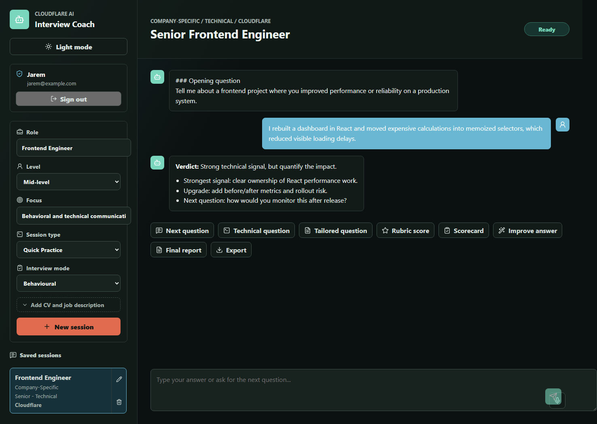

# cf_ai_interview_coach

AI Interview Coach is a Cloudflare AI application for practicing interview answers. It uses a chat interface, Workers AI for coaching responses, a Worker API for coordination, and D1 for persistent session memory.

## What It Uses

- LLM: Cloudflare Workers AI with `@cf/meta/llama-3.3-70b-instruct-fp8-fast`
- Coordination: Cloudflare Worker API
- User input: React chat UI on Cloudflare Pages
- Memory/state: Cloudflare D1 sessions, messages, and rolling coaching summaries

## Why This Fits Cloudflare

This project was designed specifically for the Cloudflare AI assignment. It uses Cloudflare Pages for the frontend, Workers for API coordination, Workers AI for LLM inference, and D1 for persistent session memory. I chose this architecture to learn how Cloudflare's developer platform can support full-stack AI applications without relying on external APIs.

## Screenshots

### Session Setup


### Dark Mode



## App Flow

1. Choose a target role, level, and interview focus.
2. Use guided suggestions or upload a resume/CV for more tailored setup.
3. Start a saved coaching session.
4. Follow the mode-aware coaching actions or type your own answers.
5. The Worker stores each turn in D1, sends recent context plus summary memory to Workers AI, stores the reply, and periodically updates coaching memory.

## Features

- Normal in-app sign-in for a browser-backed practice profile.
- Persistent mock interview sessions per signed-in browser profile.
- Resume/CV upload for PDF, DOCX, TXT, and Markdown files.
- Guided autocomplete for role, level, and focus setup fields.
- Context-aware coaching with recent chat history and rolling D1 memory.
- Mode-aware coaching actions for first/next questions, technical drills, scorecards, and improving the last answer.
- Stronger scenario-based technical interviewing prompts.
- End-of-session report generation.
- Rename and delete saved sessions.
- Markdown export for a session transcript.
- Local API tests with mocked D1 and mocked Workers AI.
- Cost-conscious prompts that keep replies compact and update summary memory every few user turns.

## Local Setup

Install dependencies:

```bash
npm install
```

Create a local D1 database and apply migrations:

```bash
npm run db:local
```

Run the Worker API:

```bash
npm run dev:api
```

In another terminal, run the Pages frontend:

```bash
npm run dev:web
```

Open `http://localhost:5173`. The Vite dev server proxies `/api` requests to `http://localhost:8787`.

## Verification

```bash
npm run typecheck
npm test
npm run build
```

## Cloudflare Deployment

Log in to Cloudflare:

```bash
npx wrangler login
```

Create a D1 database:

```bash
npx wrangler d1 create interview_coach
```

Copy the returned `database_id` into the root `wrangler.toml`.

Apply the remote migration:

```bash
npm run db:remote
```

### Sign-in

The app has a normal sign-in screen that stores a lightweight browser profile in `localStorage`. Sessions and messages are keyed to that profile id in D1.

Do not put an external access gate in front of the public Pages or Worker hostnames for the normal user flow. The frontend talks directly to the Worker API using the app profile id for session ownership.

Deploy the Worker API:

```bash
npm run deploy:api
```

Deploy the Pages frontend:

```bash
npm run deploy:web
```

If you change the Worker URL, update `apps/web/.env.production` before redeploying Pages.

## Live Demo

- App: https://cf-ai-interview-coach-bml.pages.dev
- Worker API health: https://cf-ai-interview-coach-api.jarems421.workers.dev/api/health

The frontend production build uses `apps/web/.env.production` so deployed Pages requests go to the live Worker API.

## Project Notes

- The app profile is stored in `localStorage`.
- The app keeps memory per profile id and session id.
- No passwords, payments, external access gate, or external LLM APIs are required for v1.
- Development prompts and AI prompt text are documented in `PROMPTS.md`.

## Future Improvements

- Add shareable session links behind lightweight authentication.
- Add rubric presets for behavioral, system design, coding, and leadership interviews.
- Store final reports separately from chat messages.

## Useful Cloudflare Docs

- Workers AI Llama 3.3 model: https://developers.cloudflare.com/workers-ai/models/llama-3.3-70b-instruct-fp8-fast/
- Workers AI bindings: https://developers.cloudflare.com/workers-ai/configuration/bindings/
- D1 databases: https://developers.cloudflare.com/d1/
- Pages deployments: https://developers.cloudflare.com/pages/
