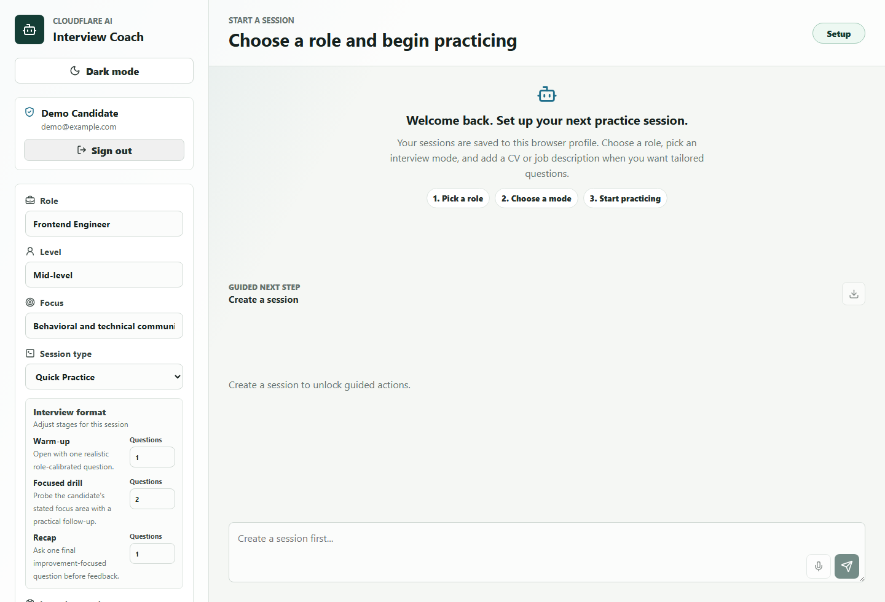
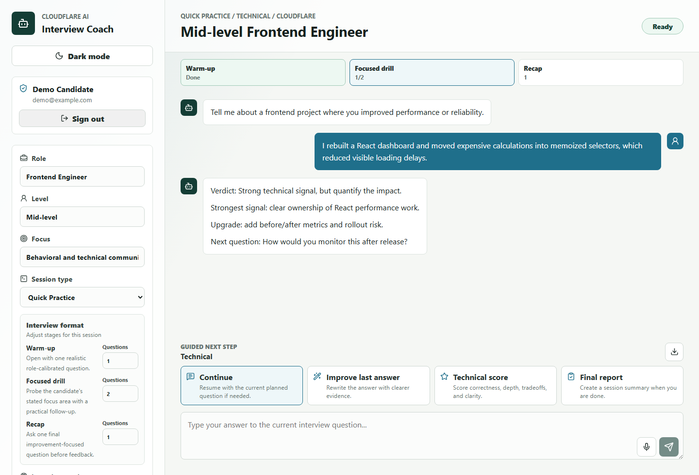
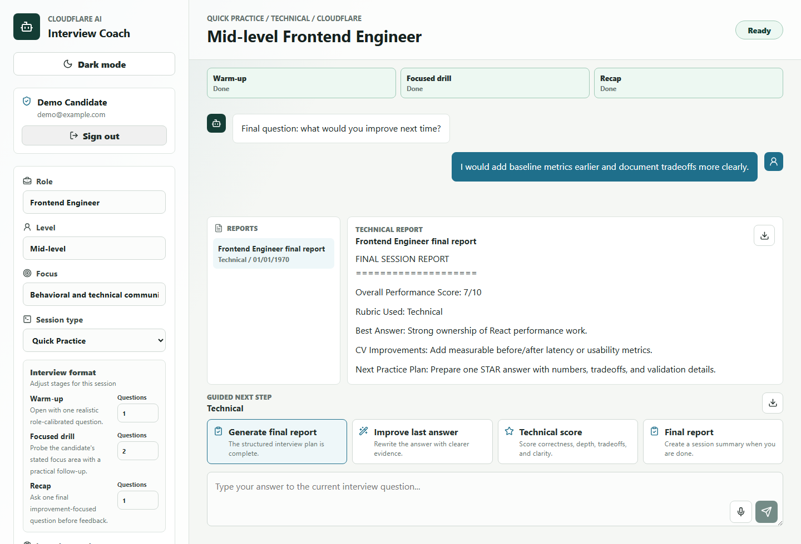

# Cloudflare AI Interview Coach

AI Interview Coach is a Cloudflare AI application for practicing interview answers. It uses a chat interface, Workers AI for coaching responses, a Worker API for coordination, and D1 for persistent session memory.

The app runs structured mock interviews: the AI interviewer asks one question at a time, scores or improves answers on request, advances a stage timeline, and produces a final coaching report tailored to the candidate's CV and target role.

## What It Uses

- LLM: Cloudflare Workers AI with `@cf/meta/llama-3.3-70b-instruct-fp8-fast`
- Coordination: Cloudflare Worker API
- User input: React chat UI on Cloudflare Pages
- Memory/state: Cloudflare D1 sessions, messages, and rolling coaching summaries
- Auth: Cloudflare Access in production, local browser profiles in development

## Why Cloudflare

This project uses Cloudflare Pages for the frontend, Workers for API coordination, Workers AI for LLM inference, D1 for persistent session memory, and Cloudflare Access for production authentication. The goal is to show how Cloudflare's developer platform can support a full-stack AI application without relying on an external LLM API.

## Screenshots

### Session Setup



### Structured Interview Timeline



### Final Report



## App Flow

1. Choose a target role, level, and interview focus.
2. Use guided suggestions or upload a resume/CV for more tailored setup.
3. Start a saved coaching session.
4. Click **Start interview** once, then answer each interviewer question in the composer.
5. The Worker stores each turn in D1, asks Workers AI for feedback plus the next planned question, advances the interview timeline, and periodically updates coaching memory.
6. When the plan completes, generate a final coaching report with CV and job-fit feedback.

## Features

- Cloudflare Access-backed authentication for deployed use, with browser-backed practice profiles kept only for local development fallback.
- Persistent mock interview sessions per authenticated Access user or local development profile.
- Resume/CV upload for PDF, DOCX, TXT, and Markdown files, with parser warnings and clearer corrupt-file errors.
- Guided autocomplete for role, level, and focus setup fields.
- Context-aware coaching with recent chat history and rolling D1 memory.
- Per-session opt-in cross-session coaching memory, disabled by default for privacy.
- Interviewer persona and difficulty controls for supportive, realistic, strict, standard, challenging, and senior practice.
- Structured interview plans with stage-aware progress that advances when the AI interviewer asks the next planned question.
- Adaptive answer handling: vague answers can trigger a coaching pause and retry prompt instead of blindly advancing.
- Mode-aware scoring tools for rubric scores, scorecards, improving the last answer, and final reports.
- Stronger scenario-based technical interviewing prompts.
- Evidence-backed end-of-session reports that cite specific answer patterns from the transcript.
- Rename and delete saved sessions.
- Markdown export for a session transcript.
- Local API tests with mocked D1 and mocked Workers AI.
- Deterministic AI evaluation harness with generated JSON and Markdown results.
- Cost-conscious prompts that keep replies compact and update summary memory every few user turns.

## Local Setup

Install dependencies:

```bash
npm install
```

Create a local D1 database and apply migrations:

```bash
npm run db:local
```

Create local Worker variables:

```bash
Copy-Item .dev.vars.example .dev.vars
```

Run the Worker API:

```bash
npm run dev:api
```

In another terminal, run the Pages frontend:

```bash
npm run dev:web
```

Open `http://localhost:5173`. The Vite dev server proxies `/api` requests to `http://localhost:8787`.

## Verification

```bash
npm run typecheck
npm test
npm run eval
npm run build
npm run test:e2e
```

## Cloudflare Deployment

Log in to Cloudflare:

```bash
npx wrangler login
```

Create a D1 database:

```bash
npx wrangler d1 create interview_coach
```

Copy the returned `database_id` into the root `wrangler.toml`.

Apply the remote migration:

```bash
npm run db:remote
```

### Authentication

The Worker supports two auth modes:

- `AUTH_MODE=access`: production mode. The Worker verifies the Cloudflare Access JWT from `Cf-Access-Jwt-Assertion` or the `CF_Authorization` cookie, validates issuer/audience/expiry/signature against Access certs, and derives session ownership from the Access subject.
- `AUTH_MODE=development`: local fallback. The app uses a browser profile id from `localStorage` so local development does not need Access setup.

For production, configure:

```bash
npx wrangler secret put AUTH_MODE
npx wrangler secret put ACCESS_TEAM_DOMAIN
npx wrangler secret put ACCESS_AUD
```

Use `access` for `AUTH_MODE`, your Access team domain for `ACCESS_TEAM_DOMAIN`, and the Access application audience tag for `ACCESS_AUD`.

Do not describe the development fallback as secure auth; it is only for local/demo convenience.

Once configured, an authenticated `/api/me` response should include:

```json
{
  "user": {
    "id": "access:...",
    "email": "user@example.com",
    "authenticated": true
  }
}
```

Deploy the Worker API:

```bash
npm run deploy:api
```

Deploy the Pages frontend:

```bash
npm run deploy:web
```

If you change the Worker URL, update `apps/web/.env.production` before redeploying Pages.

## Live Demo

- App: https://cf-ai-interview-coach-bml.pages.dev
- Worker API: https://cf-ai-interview-coach-public-api.jarems421.workers.dev

The Worker API is protected by Cloudflare Access in production. Direct unauthenticated requests may return a Cloudflare `403` before they reach the Worker.

The frontend production build uses `apps/web/.env.production` so deployed Pages requests go to the live Worker API.

## Project Notes

- In production Access mode, user identity comes from the verified Cloudflare Access token.
- Access signing keys are fetched from the team domain and cached by the Worker.
- In development fallback mode, the app keeps memory per browser profile id and session id.
- Interview progress is stored in D1 and is advanced by the Worker when the interviewer asks the next planned question.
- No app-managed passwords, payments, or external LLM APIs are required for v1.
- Development prompts and AI prompt text are documented in `PROMPTS.md`.

## Repository Hygiene

- Do not commit `.dev.vars`, `.env`, Wrangler state, build output, Playwright reports, or logs.
- Use `.dev.vars.example` and `.env.example` for safe local setup hints.
- Generated evaluation outputs live in `docs/evaluation/` and are safe to commit as evidence.
- Screenshots used by the README live in `docs/screenshots/`.
- Security expectations are documented in `SECURITY.md`.

## Future Improvements

- Add shareable session links with Access-aware permissions.
- Add more real-world resume fixtures from anonymized PDFs and DOCX files.

## Useful Cloudflare Docs

- Workers AI Llama 3.3 model: https://developers.cloudflare.com/workers-ai/models/llama-3.3-70b-instruct-fp8-fast/
- Workers AI bindings: https://developers.cloudflare.com/workers-ai/configuration/bindings/
- D1 databases: https://developers.cloudflare.com/d1/
- Pages deployments: https://developers.cloudflare.com/pages/
